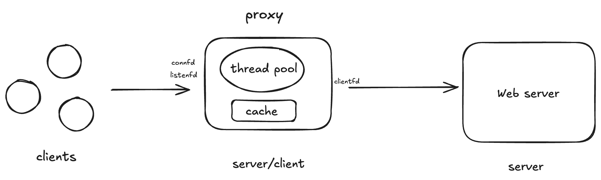

# TinyProxy

## 项目背景
TinyProxy是基于CS:APP Proxy Lab扩展实现的http多线程代理服务器

## 实现功能
HTTP1.0转发   

并发连接处理   

请求头规范化    

LRU缓存淘汰策略

## 架构图




## 运行测试

启动docker并挂载当前目录到容器
```bash
docker run -it --rm -v "$(pwd)":/workspace -w /workspace ubuntu:20.04 /bin/bash
```   
可以在另一个bash使用docker exec -it开多个进入同一docker中

安装必要工具链
```bash
apt update
apt install -y build-essential python3 python3-pip curl net-tools
```
在当前目录下编译运行tiny服务器
```bash
cd./tiny && make clean && make
//前台运行proxy
cd ./tiny && ./tiny 7778
//后台运行proxy
cd ./tiny && ./tiny 7778 & cd..
```
编译，并在后台运行proxy
```bash
make clean && make && ./proxy 7777 &
```

访问tiny服务器
```bash
curl -v --proxy http://localhost:7777 http://localhost:7778
```
运行测试(代理功能 并发访问 缓存测试)
```bash
./driver.sh
```


